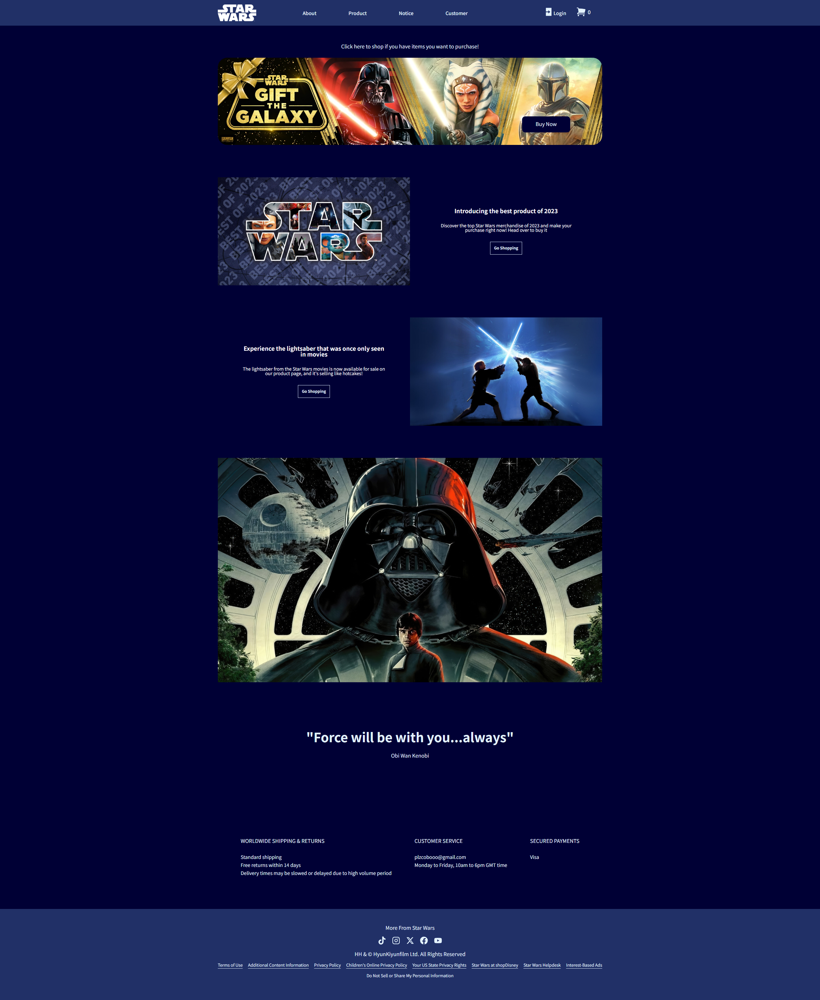
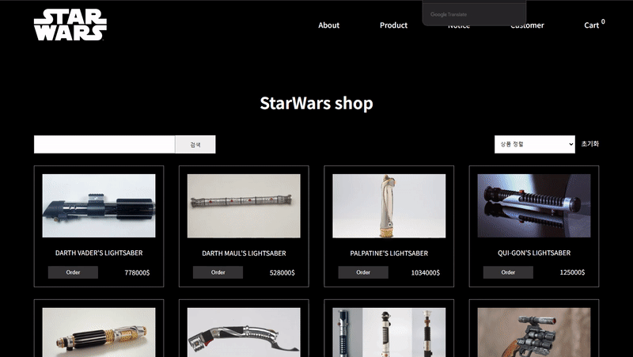
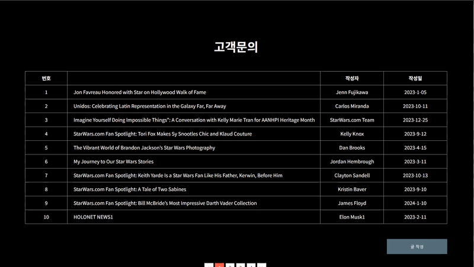
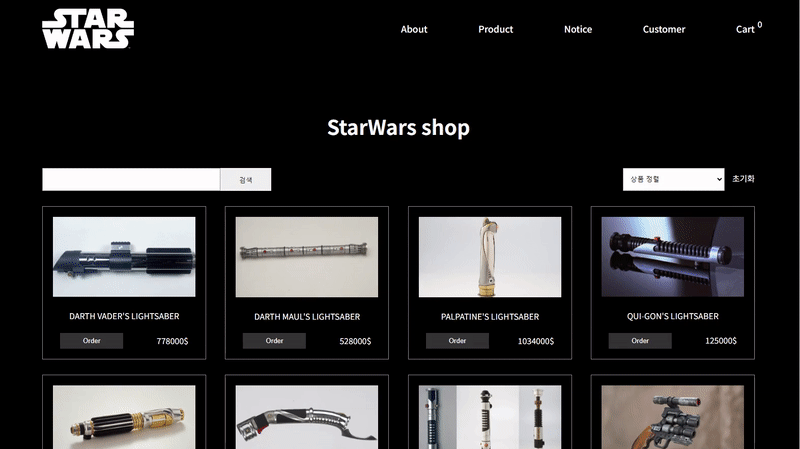

## [초기화면]
- 프론트엔드 CRUD 및 쇼핑몰 장바구니 기능이 구현된 쇼핑몰입니다.

| 초기화면 |
|----------|


- 배포 URL : https://plzcoboo.github.io/StarShop/dist

## 프로젝트 소개

- 평소 좋아하는 테마를 정해 REACT 를 이용하여 이미지 갤러리를 만들었습니다.

## 개발 환경

- Front : HTML, React, styled-components , Redux , Router
- Back-end : 로컬 API 사용
- 버전 및 이슈관리 : Github
- 서비스 배포 환경 : Github pages


## 프로젝트 주요 기능
1. 장바구니
2. 정렬
3. 검색
4. 게시판
   
## 개발 기간

- 일주일 소요 

## 프로젝트 작업 순서
1. 자료조사 및 사이트 참고
2. 디자인 계획 및 마크업
3. React  / Styled-Components / Redux-toolkit 사용

## 프로젝트 구조

```
📦src
 ┣ 📂assets
 ┃ ┗ 📂api
 ┃ ┃ ┣ 📜cartdata.jsx
 ┃ ┃ ┣ 📜customerdata.js
 ┃ ┃ ┗ 📜noticedata.js
 ┣ 📂components
 ┃ ┣ 📂cart
 ┃ ┃ ┣ 📜CartEmpty.jsx
 ┃ ┃ ┣ 📜CartItem.jsx
 ┃ ┃ ┣ 📜CartList.jsx
 ┃ ┃ ┗ 📜CartStyle.js
 ┃ ┣ 📂customer
 ┃ ┃ ┣ 📜CustomerAdd.jsx
 ┃ ┃ ┣ 📜CustomerDetail.jsx
 ┃ ┃ ┣ 📜CustomerEdit.jsx
 ┃ ┃ ┣ 📜CustomerItem.jsx
 ┃ ┃ ┣ 📜CustomerLIst.jsx
 ┃ ┃ ┗ 📜CustomerStyle.js
 ┃ ┣ 📂notfile
 ┃ ┃ ┣ 📜NotFiles.jsx
 ┃ ┃ ┗ 📜NotFileStyle.js
 ┃ ┣ 📂notice
 ┃ ┃ ┣ 📜NoticeDetail.jsx
 ┃ ┃ ┣ 📜NoticeItem.jsx
 ┃ ┃ ┣ 📜NoticeList.jsx
 ┃ ┃ ┗ 📜NoticeStyle.js
 ┃ ┣ 📂pagination
 ┃ ┃ ┣ 📜Pagination.jsx
 ┃ ┃ ┗ 📜paginationStyle.js
 ┃ ┣ 📂product
 ┃ ┃ ┣ 📜ProductItem.jsx
 ┃ ┃ ┣ 📜ProductSearch.jsx
 ┃ ┃ ┗ 📜ProductStyle.js
 ┃ ┣ 📜Layout.jsx
 ┃ ┗ 📜Spinner.jsx
 ┣ 📂footer
 ┃ ┣ 📜Footer.jsx
 ┃ ┗ 📜FooterStyle.js
 ┣ 📂header
 ┃ ┣ 📜Header.jsx
 ┃ ┣ 📜HeaderStyle.js
 ┃ ┗ 📜NavBar.jsx
 ┣ 📂hooks
 ┃ ┣ 📜useAxios.jsx
 ┃ ┣ 📜useInput.jsx
 ┃ ┗ 📜설명.txt
 ┣ 📂pages
 ┃ ┣ 📂about
 ┃ ┃ ┣ 📜About.jsx
 ┃ ┃ ┗ 📜AboutStyle.js
 ┃ ┣ 📂cart
 ┃ ┃ ┣ 📜Cart.jsx
 ┃ ┃ ┗ 📜ProjectStyle.js
 ┃ ┣ 📂customer
 ┃ ┃ ┣ 📜Customer.jsx
 ┃ ┃ ┗ 📜CustomerStyle.js
 ┃ ┣ 📂login
 ┃ ┃ ┣ 📜Join.jsx
 ┃ ┃ ┣ 📜Login.jsx
 ┃ ┃ ┣ 📜LoginMain.jsx
 ┃ ┃ ┣ 📜LoginStyle.js
 ┃ ┃ ┗ 📜Logout.jsx
 ┃ ┣ 📂main
 ┃ ┃ ┣ 📜Banner.jsx
 ┃ ┃ ┣ 📜Content1.jsx
 ┃ ┃ ┣ 📜Content2.jsx
 ┃ ┃ ┣ 📜Content3.jsx
 ┃ ┃ ┣ 📜Content4.jsx
 ┃ ┃ ┣ 📜ContentStyle.js
 ┃ ┃ ┣ 📜Main.jsx
 ┃ ┃ ┗ 📜MainStyle.js
 ┃ ┣ 📂notice
 ┃ ┃ ┣ 📜Notice.jsx
 ┃ ┃ ┗ 📜NoticeStyle.js
 ┃ ┗ 📂product
 ┃ ┃ ┣ 📜Product.jsx
 ┃ ┃ ┗ 📜ProductStyle.js
 ┣ 📂store
 ┃ ┣ 📂modules
 ┃ ┃ ┣ 📜authSlice.jsx
 ┃ ┃ ┣ 📜cartSlice.jsx
 ┃ ┃ ┣ 📜customerSlice.jsx
 ┃ ┃ ┣ 📜noticeSlice.jsx
 ┃ ┃ ┗ 📜paginationSlice.jsx
 ┃ ┗ 📜index.jsx
 ┣ 📂styled
 ┃ ┣ 📜GlobalStyle.js
 ┃ ┗ 📜Style.js
 ┣ 📜App.jsx
 ┗ 📜main.jsx
```

## 프로젝트 기능 구현

### 1) 제품페이지

* 영어제품(대소문자 구별) 검색 구현
* order 클릭시 장바구니 해당 제품 장바구니 이동
* 제품 order 수량 추가 (구현예정 => 완료)
* 제품명, 가격 , 카테고리 별로 정렬


### 2) 공지사항 게시판

* 로컬에 있는 데이터 map 출력
* 해당 게시글 클릭시 상세내용 이동
* 목록으로 이동시 라우터 처리
* next 및 번호 클릭시 페이지네이션 적용


### 3) 고객문의 게시판

* 공지사항 게시판과 동일한 기능 구현
* 글 작성 수정 Create(생성), Read(읽기), Update(갱신), Delet(삭제)기능



### 4) 로그인 회원가입
* 회원가입시 데이터 이메일, 닉네임 , 비밀번호 로컬스토리지 저장(구현예정)
* 회원가입시 등록된 가데이터로 로그인 기능 구현 (구현예정)
* 로그인시에 화면상단에 로그아웃 버튼 - 닉네임이 출력되도록 구현 (구현예정)
* 로그인시에만 글작성 수정 삭제 가능하도록 구현 (구현예정)


### 5) 장바구니
* 제품페이지에 추가된 물품 수량 증가 감소시 총 가격에 반영
* 각 제품당 재고 수량에 맞춰서 증가 감소 적용 (구현예정 => 완료) 
* 체크 박스 체크시 해당 제품만 삭제 가능하도록 기능 구현 (구현예정 => 완료)
* 장바구니 전체삭제 체크박스 선택삭제 기능 구현 (구현예정 => 완료) 



